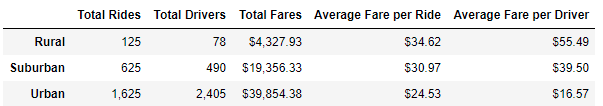
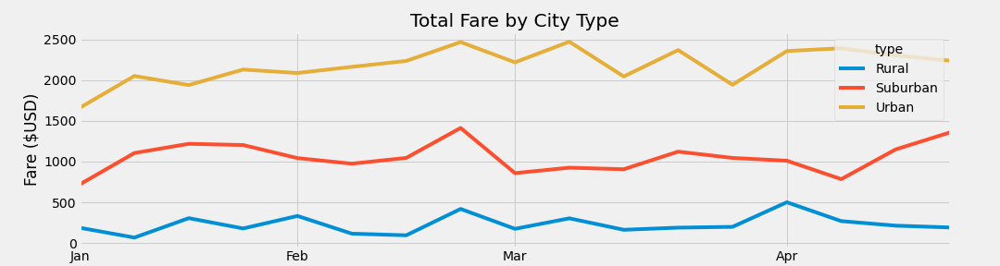

# PyBer_Analysis
## Overview of Project
Create a summary DataFrame of the ride-sharing data by city type with a multiple-line graph that shows the total weekly fares for each city type so we can give recommendations for any potential changes that could be made to help productivity and profit.

## Results
As you can see from the below table:
- Urban sees a lot more volume of rides and drivers than suburban and rural by a large amount, suburban coming somewhere in between both but urban is actually seeing more drivers than there are rides
- It follows that Urban is seeing the highest amount of total fares, almost double suburban and just under 10 times rural
- The average fare per ride and per driver is the opposite though with rural coming in with the highest numbers and urban coming in with the lowest

And from the below chart you can see:
- The splits that we note from the table are fairly consistent throughout the months with the total fare amount staying split with urban coming in at approximately twice the amount as suburban and suburban coming in at approximately five times the amount as rural with a little variance

## Summary
Based on these results we have a couple recommendations:
1. Firstly, I'd look closely at the total rides and total drivers columns. While Rural and Suburban both have more rides than there are drivers we're seeing almost 1000 more drivers than there are rides in the Urban cities. This means some drivers aren't getting any rides at all. While this can be a good thing for your customers in Urban cities as availablity is very convenient, it will also lead to the opposite with your drivers. Many of them will be driving and not be getting any rides at all which may result in disgruntled drivers and end up losing you a number of drivers.
2. To combat the above you can try to get drivers to work in the more Rural and Suburban areas as not only are there less drivers, but the average fares are higher too which would result in more payment to the drivers.
3. Another option is to advertise to the Rural and Suburban communities more (Suburban would probably be the most useful) to get more people using Pyber in those areas. As while their total fares are low it's only because of the very low volume of rides. If you were able to get the volume of rides up in those areas it would give you much better results as with just over a third of the rides, Suburban has made half the amount as the Urban areas with one fifth of the amount of drivers. So if you can get more riders in the suburbs you would not only be increasing your bottom line, it would also entice more of your Urban drivers to go to those areas to drive as they would make more money with the same amount of work.
